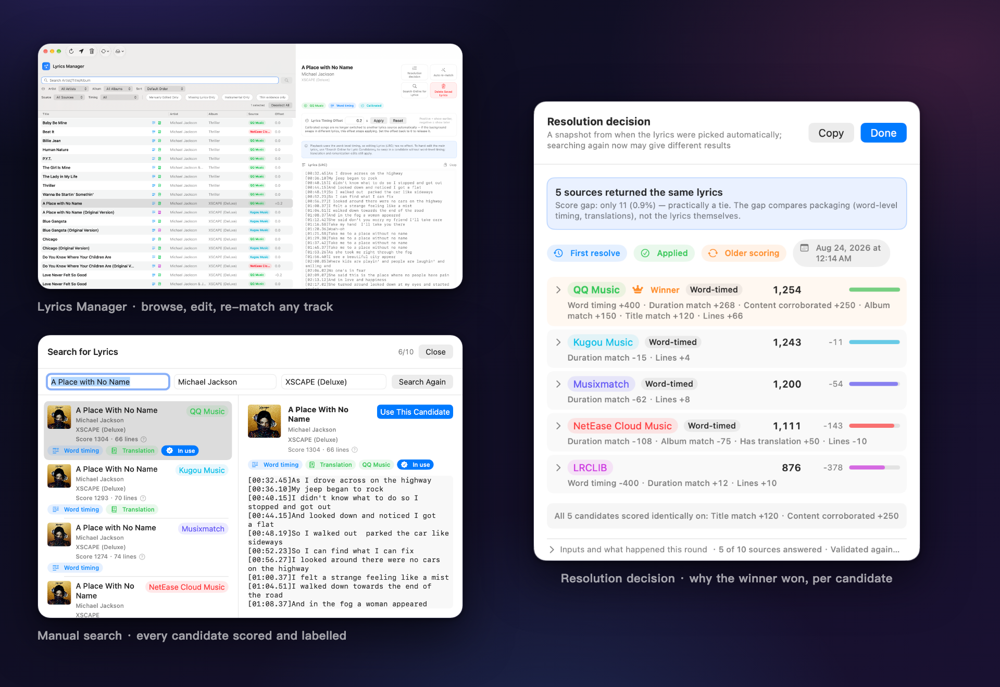

<div align="center">


# Lyrimuse

**跟着 Apple Music、QQ 音乐、网易云音乐、酷狗音乐、Spotify，或浏览器里的网页版 YouTube Music / Spotify 播放，在 Mac 桌面上实时显示逐字同步歌词——外加端上机器翻译。**

**语言 / Language:** [English](README.md) | **简体中文** | [繁體中文](README.zh-Hant.md)


[](LICENSE)

</div>

Lyrimuse 常驻在菜单栏里，跟着当前播放弹出一个桌面悬浮歌词层——Apple Music、QQ 音乐、网易云音乐、酷狗音乐、Spotify，以及浏览器里的网页版 YouTube Music / Spotify，任选几个组合（也可以交给自动识别）——逐字同步、常驻置顶、跨 Space 显示。就是网易云音乐桌面客户端那种"桌面歌词"体验，只不过是原生 macOS 版本。

**从 LyricsX 过来的？** LyricsX 自 2022 年 4 月起再没发过新版本。Lyrimuse 是一个持续维护的开源替代，**所有歌词源的候选统一打分、择优胜出，专治匹配错版本**，还额外覆盖 QQ 音乐 / 网易云 / 酷狗和浏览器网页播放器——这里有一份逐项核实过的[与 LyricsX、Lyric Fever 的对比](docs/lyrics-apps-comparison.zh-CN.md)。

**安装：** `brew tap yudaotor/lyrimuse && brew install --cask lyrimuse`（Apple Silicon 与 Intel 都支持；自动清掉一次性的 Gatekeeper 拦截）——或者去 [最新 Release](https://github.com/Yudaotor/lyrimuse/releases/latest) 手动下载，详见[快速开始](#快速开始)。


<p align="center"><sub>歌词引擎——歌词管理、每个候选都打分的手动搜索、以及每首歌「赢家为什么赢」的解析决策</sub></p>

## 功能特性

### 歌词，做到位
- **逐字同步高亮**，跟随播放进度实时显示
- **自动查五个歌词源**——LRCLIB、酷我、网易云音乐、酷狗、QQ 音乐——自动挑出最合适的一份，不用自己动手搜
- **罗马音 + 翻译**，跟原文一起显示——歌词源自带社区翻译时优先用它，没有的话走端上机器翻译（Apple 系统翻译，歌词不出本机），翻不了再退联网兜底，译文语言可选 18 种；罗马音按行判断，中日双语歌只有日文行会标注读音，不会连中文一起标上拼音；粤语歌自动标注粤拼（按词消歧）
- **对唱/多人合唱歌词分开显示**，只要来源标出了是谁在唱哪一句，就不会把两个人的声部糊成一团
- **简繁中文切换**，独立于 App 界面语言，只管歌词文字本身用哪种写法
- **完整的「歌词管理」窗口**——浏览、手改、删除、重新搜索任意一首歌的歌词，支持多选批量删除、列宽随手拖，遇到不同步还能单独调整这首歌的时间轴偏移；没搜到词的存量歌曲还能一键全部重试
- **本地模式完全离线**——已经缓存好的歌词不需要联网也能显示

### 想怎么看，你说了算
- **播放器可多选，或者交给自动识别**：读 Apple Music（走「自动化」权限）、QQ 音乐、网易云音乐、酷狗音乐或 Spotify（都走 macOS 系统级 MediaRemote，不需要任何权限）的播放状态——在设置里任意组合勾选，也可以直接留在自动识别，跟随 macOS 当前系统级 Now Playing 焦点
- **Apple Music 电台也当正经播放源**——电台里每首歌的歌词都跟得上，不会越走越偏；主播说话的时候显示电台名和台标，而不是停在上一首歌；电台歌词还有独立的时间偏移，常听的台校一次就一直对
- **网页播放器也是正经播放器**：配对一次你常用的浏览器，网页版 YouTube Music 或 Spotify 就能当播放器用——歌词按页面自己的进度条精确同步，还有一键自检告诉你浏览器到底能不能被驱动；YouTube Music 网页广告还有一颗跳过的按钮
- **两种展示方式**：经典桌面悬浮窗（想拖哪儿拖哪儿，也可以钉在顶部居中、或 Dock 之上的底部居中）和菜单栏歌词——任意开启一种、两种，或者都不开
- **菜单栏文字模式**——不想要悬浮窗，直接在状态栏看当前这一行歌词；太长的句子会横向滚动播完，而不是截成半句（想要截断也留着开关）；还可以加开一行副行，把下一句、译文或罗马音直接排在当前句下面
- **进度条拖着就能跳**——悬浮歌词的进度条会跟着播放，也可以直接拖动跳转
- **一键跳到当前歌曲的页面**——在「⋯」菜单或简介面板里点一下，Apple Music 直接在 App 内打开，Spotify 会跳到正在播的这首歌，QQ 音乐、网易云音乐会打开对应歌曲/专辑/歌手的网页；不用自己搜，链接是查歌词那会儿就顺手解析好的
- **外观完全自定义**：字体（也可以跟随系统）、字号、文字/背景/阴影颜色（可以存成配色主题反复用，也可以让文字颜色跟着当前专辑封面走）、悬浮窗宽度
- **截屏/录屏/共享屏幕时自动隐藏**——只有你自己在这台 Mac 上还能看见
- **暂停时自动收起**，不会占着桌面空转

### 一个懂事的 Mac 应用该有的样子
- **简体中文、繁體中文、英文界面**，切换立即生效，不用重启
- **全局快捷键**，覆盖每一个常用动作，默认都不绑定任何按键，交给你自己决定
- **设置可以搜索**——在侧栏输入就能直接找到那一项，命中的行会高亮并滚到眼前，藏在折叠区里的也会自己展开
- **可选的双向联动启动，逐播放器勾选**——打开 Lyrimuse 时拉起播放器、播放器打开时拉起 Lyrimuse，还可以让 Lyrimuse 在绑定的播放器全部退出后跟着退出
- **导出/导入完整配置**，方便换到新 Mac；还有一键导出诊断信息，方便排查问题

### 附加功能（可选）
以下全部默认关闭、按需开启，都在设置里配置：

- **提交听歌记录到 [ListenBrainz](https://listenbrainz.org)**——连接后，把同一份实时播放状态提交到你的听歌历史
- **一个可以到处分享的"正在听什么"网页**——实时播放状态、历史播放、留言墙、表情反应、访客计数、历史 Top10 歌手榜单、黑胶唱片视觉效果、深浅色主题，分享到聊天工具里还会自动展开预览卡片。完整效果展示 + 从零搭建教程见 **[网页玩法教程](https://github.com/Yudaotor/nowplaying-workers#readme)**。
- **每周听歌小结**，通过推送通知发给你（支持 Bark、钉钉、企业微信、Discord、飞书、Server酱）

以上每一项都在设置的「附加功能」里配置，每张账号卡片自带完整的分步引导——去哪申请 API Key/Token、怎么连接账号、怎么给选定的推送平台拿到 Webhook 地址，点开对应卡片就有。网页展示页是唯一单独写了一份教程、而不是塞进设置里一个小弹窗的，但这不代表它是硬性前提——光配好 ListenBrainz，网页就已经能显示实时播放和历史，不需要部署任何 Cloudflare Worker。额外部署一份能加上留言墙、表情反应、访客计数、Top10 歌手榜单，以及延迟更低的更新，想要这些再看教程。

## 快速开始

Lyrimuse 一直都是 ad-hoc 签名——不管用下面哪种方式拿到，都不涉及 Apple 开发者账号。也因为这样，除了下面的方案 A（会自动清掉这一步），其它方式第一次打开时 Gatekeeper 都会提示"来自身份不明的开发者"——这是预期行为，不是 bug，方案 B 里有一次性手动解决办法。

### 方案 0：把安装丢给 AI

如果你的 Mac 上跑着能执行终端命令的 AI 助手（Claude Code、Codex CLI、Gemini CLI 等），把下面这段话**原样**贴给它，方案 A/B 的所有步骤它都会替你做完。这段话术只允许它装这一个应用——全程不用 `sudo`，也不碰系统级安全设置：

```text
请在这台 Mac 上安装 Lyrimuse——一个开源的 macOS 菜单栏歌词应用
（https://github.com/Yudaotor/lyrimuse），严格按以下规则执行：

1. 首选路径（如果有 `brew`）：
     brew tap yudaotor/lyrimuse
     brew trust --cask yudaotor/lyrimuse/lyrimuse
     brew install --cask lyrimuse
   如果这台机器的 Homebrew 没有 trust 子命令，跳过那一行——旧版本不需要。
2. 没装 Homebrew 的话，不要替我安装 Homebrew。改走手动路径：先用 `uname -m`
   确认芯片架构，去 https://github.com/Yudaotor/lyrimuse/releases 下载最新版本
   对应的文件——arm64 下 `Lyrimuse-<版本>-macos.zip`，x86_64 下
   `Lyrimuse-<版本>-macos-intel.zip`——用同处提供的 `.sha256` 文件校验
   （`shasum -c`），解压后把 `Lyrimuse.app` 移进 /Applications，然后只对这
   一个 app 清除 Gatekeeper 隔离标记：
     xattr -dr com.apple.quarantine /Applications/Lyrimuse.app
3. 安全红线：全程不用 `sudo`（这里没有任何一步需要它）；绝不执行
   `spctl --master-disable` 或任何全局关闭 Gatekeeper 的操作；除
   /Applications/Lyrimuse.app 外不得对任何东西清除隔离标记。
4. 除非我明确要求，不要从源码构建。
5. 启动它（`open -a Lyrimuse`），并确认在运行（`pgrep -x Lyrimuse` 能打出 PID）。
6. 首次启动会弹出引导向导——那部分由我自己点：告诉我它会让我选播放器、
   （只在选 Apple Music 时）授权对 Music.app 的「自动化」访问、以及启用后台
   采集服务，然后把控制权交还给我。
最后用中文汇报你做了什么、有没有失败的步骤。
```

### 方案 A：用 Homebrew 安装（推荐）

```bash
brew tap yudaotor/lyrimuse
brew trust --cask yudaotor/lyrimuse/lyrimuse   # 一次性操作——Homebrew 要求任何非官方 tap 都得先信任
brew install --cask lyrimuse
```

安装过程中会自动清掉这次的 Gatekeeper 隔离标记，不需要额外操作——`brew install` 跑完直接从 `/Applications`（或者 Spotlight）打开 Lyrimuse 就行。以后有新版本，`brew upgrade --cask lyrimuse` 同样能自动处理。

### 方案 B：手动下载预编译版本

1. 去 [Releases 页面](https://github.com/Yudaotor/lyrimuse/releases) 下载。**先看清自己是哪种 Mac**（左上角  → 关于本机 →「芯片」：`Apple M…` 是 Apple Silicon，`Intel Core…` 是 Intel）：

   | 你的 Mac | 下这份 |
   | --- | --- |
   | Apple Silicon（M1 及以后） | `Lyrimuse-*-macos.dmg` 或 `.zip` |
   | Intel | `Lyrimuse-*-macos-intel.dmg` 或 `.zip` |

   dmg 双击挂载后把 `Lyrimuse.app` 拖到旁边的 `Applications` 上；zip 解压后把 `Lyrimuse.app` 拖进 `/Applications`。两种格式装出来完全是同一个 App，zip 还附带一份 `.sha256`，想核对下载完整性就在同一目录里跑 `shasum -c Lyrimuse-*.zip.sha256`。

   两份的区别只在架构：不带后缀的那份是纯 Apple Silicon，`-intel` 那份同时含 Intel 和 Apple Silicon 两套代码。`-intel` 也能在 Apple Silicon 上跑，但没必要——体积大一倍，而且 macOS 27 及以后会因为它含 Intel 代码而提示「需要更新 App」（Apple 要在 macOS 28 移除 Rosetta；App 本身没问题）。


   **中国大陆下载加速：** GitHub 直连慢或超时的话，给下载地址加一个公共加速前缀即可，例如把 Releases 页复制出来的链接改成 `https://ghfast.top/https://github.com/Yudaotor/lyrimuse/releases/download/…`。镜像域名可能失效——失效就换一个可用的 gh-proxy 类前缀（用法相同，都是原链接前面加前缀），下载后照常用 `.sha256` 校验。
2. 第一次打开时 macOS 会拒绝运行——提示"Lyrimuse 已损坏，无法打开"或"来自身份不明的开发者"。用下面任意一种方式解锁一次即可：

   - **推荐——终端命令（永远有效）：**
     ```bash
     xattr -dr com.apple.quarantine /Applications/Lyrimuse.app
     ```
     然后正常打开即可，每份下载只需要做一次。
   - **右键 → 打开：** 在 Finder 里右键（或 Control-点击）`Lyrimuse.app`，选择"打开"，弹窗里再确认一次"打开"。不是每个 macOS 版本、每种提示都能用这招，不行的话回退用上面的终端命令。
   - **系统设置 → 隐私与安全性：** 先试着打开一次（会被拦下），再打开**系统设置 → 隐私与安全性**，滚到最底部，点 Lyrimuse 警告旁边的"仍要打开"，弹窗里再确认一次。

   只对你真正信任的构建版本执行这几条命令——比如这个仓库自己 Releases 页面下的，或者你自己构建的那份。

### 方案 C：自己构建

**一次性前置依赖**（已经装过的可以跳过）：

```bash
xcode-select --install   # Xcode 的 Command Line Tools，跑 Swift 用——`swift --version` 能跑就说明已经装过
```

装好之后，`build.sh` 会一次性构建原生 Swift App：

```bash
git clone https://github.com/Yudaotor/lyrimuse.git
cd lyrimuse/lyrimuse
./build.sh               # 编当前这台机器的架构
./build.sh --universal   # 编 arm64 + x86_64 的 universal 包(给 Intel 用的那份兼容包)
```

`build.sh` 最后会把包里每个二进制的架构列出来，跟目标不符（缺一半、或多带了一份）都会报出来。发布资产不要手工打——用 `./package.sh`，它自己会把两种架构各构建一次、各出一套 zip + sha256 + dmg，架构不符直接拒绝打包。

QQ 音乐/网易云音乐/酷狗音乐/Spotify/自动识别这几个播放源支持额外需要 [ungive/media-control](https://github.com/ungive/media-control)——本机没装的话 `build.sh` 会自动用 Homebrew 装一次，这一步也不需要你自己动手。

### 不管选哪种方案

从 `/Applications` 打开 Lyrimuse——首次启动的引导向导会带你完成：选一个播放器（Apple Music、QQ 音乐、网易云音乐、酷狗音乐、Spotify，或者自动识别），以及在选择 Apple Music 时允许它以「自动化」方式读取 Music.app 当前播放的歌曲信息。走完引导后，原生 Swift 歌词查询会自动开始（更多构建选项见 [lyrimuse/README.md](lyrimuse/README.md)）。

不需要再配置任何其它东西才能看到歌词——上面提到的所有附加功能都是后续在设置里按需开启的。

## 常见问题

**装这个需要 Apple 开发者账号吗？**
不需要。Lyrimuse 一直都是 ad-hoc 签名——你不需要开发者账号，这个项目本身也没有。上面「快速开始」里那个一次性的 Gatekeeper 解锁步骤就是这个原因。

**只支持 Apple Music 吗，Spotify、QQ 音乐、网易云音乐能用吗？**
都支持，外加酷狗音乐，一共五个播放器，也可以交给自动识别，跟随 macOS 当前认为的「正在播放」。Apple Music 走「自动化」权限读取；其它四个完全不需要任何额外权限，走的是 macOS 系统级 MediaRemote。

**这跟网易云音乐自带的桌面歌词是一回事吗？**
思路一样，不是同一个 App——Lyrimuse 把「桌面悬浮歌词」这套体验带给五个播放器（不只是网易云自己的客户端），原生 macOS，还提供菜单栏歌词，不只是经典悬浮窗一种形态。

**没有网络能看歌词吗？**
一首歌的歌词只要解析过一次，之后就能——本地模式直接显示已缓存的歌词，不用联网。第一次查询（以及需要机器翻译的时候）还是要联网的。

**我的数据会传到外面吗？**
解析歌词要查公开的歌词接口（LRCLIB、酷我、网易云、酷狗、QQ 音乐），封面要查 iTunes Search——这是这个功能本身决定的。翻译默认走端上（Apple 系统翻译），只有退到网络翻译时才会把歌词正文发给 MyMemory。其余的——缓存的歌词、设置——都只存在你 Mac 本地的文件里，除非你主动去连 ListenBrainz，或者那个可选的网页中继。逐项清单见下面「[许可与版权说明](#许可与版权说明)」。

**能标日语/韩语罗马音，或者翻中文吗？**
可以——罗马音按行判断（中日双语混唱的歌不会整首被判错），翻译来自歌词源自带的社区翻译，或者端上/联网机器翻译，译文语言可选 18 种。

**支持 Intel Mac 吗？**
支持，走单独的 universal 包（见上面方案 B）。需要在 Intel Mac 上运行时下载带 `-intel` 后缀的构建。

**浏览器里放的 YouTube Music / Spotify 网页版能出歌词吗？**
能——在设置里把你常用的浏览器配对一次，网页版 YouTube Music 或 Spotify 就是正经播放器：歌词按页面自己的进度条精确同步（不是估算），配对前还有一键自检告诉你这个浏览器到底能不能被驱动。

**怎么保证匹配到的歌词是对的？**
所有源返回的全部候选放在同一套标准下打分——歌名、歌手、专辑、上报时长的吻合度，再加逐字时间轴这类质量信号——分最高的胜出，而不是哪个源先返回就用哪个。决策全程可查：每首歌都有一个「解析决策」面板，列出各候选的得分和赢家胜出的原因。之后某个源出现更干净、更完整的版本时还能自动升级换上；而你手动选定的歌词会被锁定，绝不会被自动覆盖。手动搜索界面也带同样的打分和标注，选错版本一眼就能看出来。

**Lyrimuse 和 LyricsX、Lyric Fever 有什么区别？**
LyricsX（最后一版发布于 2022 年 4 月，支持 macOS 10.11+）覆盖 Apple Music、Spotify 等几个经典播放器；Lyric Fever 专注 Spotify + Apple Music，要求 macOS 15+。Lyrimuse（macOS 14+）额外原生支持 QQ 音乐 / 网易云音乐 / 酷狗，支持浏览器网页播放器，逐行判定的拼音 / 粤拼 / 注音假名，以及可选的 ListenBrainz 提交。逐项核实过的对照表见[对比页](docs/lyrics-apps-comparison.zh-CN.md)。

## 许可与版权说明

- **Lyrimuse 本身以 [GPL-3.0](LICENSE) 授权。** 随 App 一起分发的开源组件与词典数据（media-control、KeyboardShortcuts、OpenCC-derived Han variants）各自保留原许可证，全文见 [THIRD_PARTY_LICENSES](THIRD_PARTY_LICENSES)；这个文件也打进了 App 包里，**设置 → 关于 → 第三方许可**能直接打开。
- **歌词、封面与曲目信息的版权归各自的权利人所有。** Lyrimuse 只做检索、缓存与展示：公开歌词接口返回什么，就存在你自己 Mac 上的 `~/.config/lyrimuse/` 里给你自己看，不托管、不转发、不再分发任何歌词或封面；缓存随时可以在「歌词管理」里删，或者直接删掉那个文件夹。
- **Lyrimuse 是独立的开源项目**，与 Apple、腾讯（QQ 音乐）、网易（网易云音乐）、酷狗、酷我、Spotify、Google（YouTube Music）、ListenBrainz、LRCLIB 均无隶属、合作或背书关系。这些名称和商标归各自所有者，这里提到它们只是为了说明支持哪些播放器和歌词来源。
- **会离开你 Mac 的只有这些。** 解析歌词时把歌手、歌名、专辑（部分源还带时长）发给上面五个歌词源。封面把歌手加歌名发给 iTunes Search。机翻兜底（默认关，且只在端上 Apple 翻译不可用时）会把**歌词正文**分块发给 MyMemory，附一个随机生成的邮箱参数，不是你的。除此之外只有你主动连接的 ListenBrainz、推送平台和网页中继。每一条对外请求都记进本地审计日志（只记域名和操作名，不记参数和凭据），「导出诊断」里能看到。

## 排查

歌词不出来时，可以在「设置 → 歌词来源」逐个测试来源，再在「歌词管理」里对当前歌曲重新匹配；
应用日志在 `~/Library/Logs/lyrimuse-app.log`。五个来源会并发查询，单个来源失败不会阻断其它来源，
已经缓存的歌词在离线时仍然可以显示。

## 卸载

把 `Lyrimuse.app` 拖进废纸篓后，用户数据和可选的开机启动项仍会保留；需要清理时运行下面的脚本。

```sh
lyrimuse/scripts/uninstall.sh              # 只看：报告当前装了什么
lyrimuse/scripts/uninstall.sh --purge      # 连配置、缓存、日志、偏好设置一起删
```

不带参数运行不会改动任何东西，只是告诉你系统里现在有什么。`--purge` 会先把要删的东西
逐个列出来、提醒你其中有多少个已导出的歌词文件，并且要求手动输入 `yes` 才继续。

`--purge` 会注销可选的开机启动项，并连偏好设置、缓存和日志一起删（`defaults delete
me.yudaotor.lyrimuse`）。

## 项目结构

本仓库就是 App 本身：

- [`lyrimuse/`](lyrimuse) —— App 本体（Swift，SwiftUI + AppKit）
- `LyrimuseCore/Lyrics/` —— 原生 Swift 的五个歌词源、匹配器、Resolver 与时间轴模型
- [`docs/features/`](docs/features/README.md) —— 功能现状文档：覆盖剩余功能的当前行为、交互点与代码锚点（改任何功能前先读对应章）

可选的网页体验拆在两个独立的兄弟仓库里，想 fork 哪个都不用碰 App：

| 仓库 | 角色 |
|---|---|
| [`Yudaotor/nowplaying`](https://github.com/Yudaotor/nowplaying) | 可分享的"正在听什么"网页本体，外带一份可直接 fork 的模板 |
| [`Yudaotor/nowplaying-workers`](https://github.com/Yudaotor/nowplaying-workers) | 网页背后的 Cloudflare Worker 中继 + 实时 README 徽章，配完整的从零搭建教程 |

```
本仓库 (Swift App)  ──推送──▶  nowplaying-workers (中继)  ◀──读取──  nowplaying (网页)
```

## 致谢

桌面歌词这个概念要归功于 [LyricsX](https://github.com/ddddxxx/LyricsX)。
